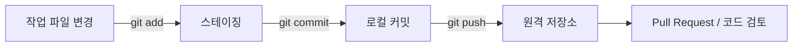

# Git & GitHub Quick Reference

**Git과 GitHub의 기본 흐름을 정리한 개인 학습 가이드입니다.**

파일 변경 기록, 브랜치 작업, 원격 저장소 공유, Pull Request의 연결을 빠르게 찾아볼 수 있도록 구성했습니다.

[기존 설명과 실습 이미지](docs/learning-notes.md) · [명령어별 실습](https://github.com/unknownamed/Git-practice) · [Git 공식 문서](https://git-scm.com/docs)

## 기본 작업 흐름

## 자주 쓰는 명령어

| 목적 | 명령어 |
| --- | --- |
| 현재 변경 상태 | `git status` |
| 파일 변경 내용 | `git diff` |
| 커밋에 넣을 파일 선택 | `git add <파일>` |
| 변경 기록 저장 | `git commit -m "설명"` |
| 커밋 목록 확인 | `git log --oneline --graph --decorate` |
| 새 브랜치 생성·이동 | `git switch -c <브랜치>` |
| 기존 브랜치 이동 | `git switch <브랜치>` |
| 현재 브랜치에 다른 브랜치 병합 | `git merge <브랜치>` |
| 원격 변경 정보 가져오기 | `git fetch origin` |
| 원격에 브랜치 올리기 | `git push -u origin <브랜치>` |
| 특정 커밋의 변경을 새 커밋으로 되돌리기 | `git revert <커밋>` |

초기 브랜치 이름은 환경 설정에 따라 달라질 수 있습니다. 브랜치가 갈라진 뒤의 병합은 서로 다른 파일을 수정했더라도 항상 fast-forward인 것은 아닙니다.

## Clone · Fork · Pull Request

| 개념 | 의미 |
| --- | --- |
| Clone | 저장소를 내 컴퓨터에 복제 |
| Fork | GitHub 계정 아래에 원본과 연결된 별도 저장소 생성 |
| Pull Request | 브랜치 변경 사항을 원본 저장소에 반영하도록 제안하고 검토 |

## 함께 보기

- [원본 학습 기록](docs/learning-notes.md): 개념 설명, 브랜치·커밋·GitHub 이미지
- [Git-practice](https://github.com/unknownamed/Git-practice): ADD·COMMIT·PUSH·MERGE·RESET·TAG·REVERT 기록
