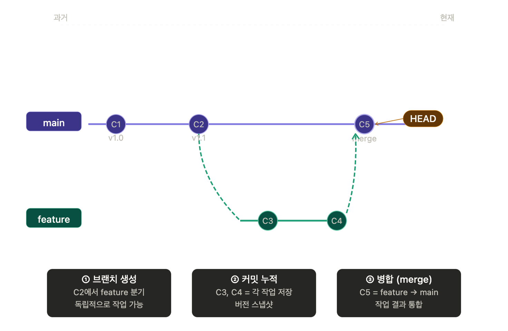

# Git과 GitHub 알아보기

## 사용 목적

```html
서로의 컴퓨터에 저장(Git)된 파일과 폴더를 공유(GitHub) -> 서로의 파일과 폴더(Git)를 자신의 컴퓨터에서 작업 -> 다시 공유(GitHub) 가능 
```

## 1. Git이 무엇일까?

```html
자신의 컴퓨터에서 파일과 폴더를 관리하고싶다 → 최종본, 최최종본, 최최최종본 …. → 이런 경우가 있지않은가?
```

```html
하나의 파일과 폴더를 버전(여러 시점으로 나누어서)으로 나누어 관리가 가능하다.
```

1. git은 우리가 실제 git init이라는 명령어로 git이라는 프로그램에게 이 폴더를 관리할꺼라고 알려줘야한다.
    
    ```html
    git init #이 폴더를 관리할꺼야 라고 알려줌 -> .git파일이 생성됨
    ```
    
2. git은 여러 갈래길을 모두 고려한다(하나의 파일이 여러 방향으로 수정되면 그것을 나누는것이 필요하지않겠는가?) → branch라는 노선을 여러개를 파서 관리가 가능하다.
    
    ```html
    git은 기본적으로 main이라는 브랜치 하나만 존재한다. 
    ```
    
    ```html
    git branch 브랜치이름 # 새 브랜치 생성
    git switch -c 브랜치이름 # -c 옵션으로 만들면서 새 브랜치 이동
    git checkout -b 브랜치이름 # -b 옵션으로 만들면서 새 브랜치 이동
    git branch # 모든 브랜치 목록 확인가능
    git branch -d 브랜치이름 # -d 옵션으로 브랜치 삭제가능
    ```
    
    → 이쯤되면 왜 브랜치를 나누지? 라고 생각할수있다. → 하나의 파일에 여러개를 다 적는 것보다는 다른 파일에 하나의 것만 적혀있는게 보기쉽고 관리가 편하지않겠는가? → 브랜치를 나눔으로써, 하나의 파일으로도 그것이 가능하게해준다!
    
    아래는 그 구조도이다.
    
    
    
    브랜치에서 각자의 부분을 개발 → merge라는 명령어를 활용 → 브랜치들을 합쳐서 다시 하나의 파일이나 폴더로 되돌리는 과정을 통해 온전한 하나의 파일이 완성될수있다.
    
    ```html
    하지만, 이 과정에서 서로가 같은 부분(예를 들면 파일)을 건드렸다고 해보자 → 그렇다면  그 파일의 내용이 서로 다르기 때문에 무엇을 수용할것인지는 우리가 직접 정해줘야한다.(이것을 충돌이 일어났다고한다 merge confilct)
    
    이 반대의 경우, 서로 다른 부분을 건드렸다면, merge conflict가 일어나지 않고 → fast forward(앞에 단순히 추가하는것임)라는 단순한 방식으로 처리된다.
    ```
    
3. git의 되돌리기 기능에 대해서
    
    ```html
    혹시 바꾸기 전에는 잘되었는데 왜 지금은 안되지? 라는 고민을 한적이 있는가? → 이때 git은 되돌리기 기능을 제공한다.
    ```
    
    git을 사용해 시점마다 그 폴더를 저장(commit)하여 이를 되돌릴수 있다.
    
    ```html
    git revert 커밋ID #커밋의 ID를 통해 되돌리기가 가능하다(협업 환경에서는 reset은 되도록이면 쓰지않는다)
    git log --oneline# 현재 브랜치를 기준으로 쌓여있는 커밋(저장)을 볼수있다, --oneline옵션은 커밋을 간단하게 볼수 있게해준다.
    ```
    
4. git의 커밋(저장)에 대해서
    
    ```html
    git status를 통해 현재 커밋에 올릴 목록에 있는지 확인 -> 
    없다면 git add로 커밋 목록에 추가 -> git commit으로 실제 저장 -> 
    git push로 실제 온라인 공간에 업로드
    ```
    
    ```html
    git status #현재 커밋 목록에 추가되었는지 확인가능
    git add 파일명 #커밋 목록에 추가가능
    git add . #모든 변경사항 추가가능
    git commit -m "넣고 싶은말" # 커밋할때 코멘트 추가가능
    git push origin 올릴 브랜치 이름 # 브랜치에 올리기 origin은 github저장소 주소임
    git push -u origin 브랜치 이름 # -u옵션으로 올릴 브랜치 고정가능 -> 향후 git push로 가능
    
    ```
    
    
    
    우리는 이제 GitHub를 통해서 온라인에 올리는 과정인 git push까지 진행하면 온라인에 공유가 된것이다.
    
    브랜치 합치기 → 내 컴퓨터에서 하기(내 컴퓨터 파일들 정리하고싶을때)
    
    ```html
    git switch 합치고싶은 살려둘 브랜치 이름    # 브랜치로 이동(합칠 브랜치 지정)
    git merge 합쳐질 브랜치 이름           # 해당 브랜치를 살려둘 브랜치에 합치기
    git branch -d 안쓰는 합쳐진 브랜치 이름 # -d 옵션으로 안쓰는 합쳐진 브랜치 삭제가능
    # 내 컴퓨터에서 merge할 때는 터미널에 git 명령어 쓰고, GitHub PR로 merge하면 명령어 안쓰고함 
    ```
    
    참고 - git 폴더 구조
    
    
    

## 2. GitHub는 무엇일까?

```html
온라인에 파일을 올릴수있도록 공간을 대여해주는 개념이다
```

1. 계정을 만들어 repository라는 저장소를 만들면 URL이나 다른 방식을 통해 내 컴퓨터의 파일을 git 명령어로 올릴수 있다
2. git과 같이 repository라는 저장소에 로컬에서와 다른 사람들이 올린 commit기록들이 남으며, 이것을 통해 전체 진행 상황을 온라인 접속으로 확인할수있다. 
3. 여러 GitHub가 제공하는 (Pullrequest(버그 수정이나, 개발이 완료된 기능을 main(기본 → 대부분 배포 가능할때 합침)브랜치에 합쳐달라는 요청)를 통해 다른 협력자들의 검토를 거쳐 수용된다) 

```html
아래는 실제 GitHub 저장소(repository) 화면이다.
```


```html
이슈 등록이나 Pull requests처럼 다양한 기능을 제공한다
```


협업할때 필요한 명령어들

```html
git clone #GitHub 저장소의 파일들을 내 컴퓨터에 받아옴
git pull #팀원 작업한 내용(github저장소에 올린것) 최신화
git remote add origin 깃허브저장소 URL #깃허브 저장소에 내 컴퓨터의 파일을 바로 올리고싶을때 push할곳(origin설정) 지정해줘야함
```

참고

```html
.gitignore파일 -> 내 컴퓨터에서 git init으로 폴더를 선택하게했을것이다. 
여기서 캐시파일(로컬에서 빨리할려고 만든것), 컴파일 파일 등 서로 어떤것을 올리지않을지 협의가 된다면 이런파일들을 제외할수있다
혹시 설정하지않으면 충돌의 원인이 될가능성이 높다.
```

1. 실제 Pull requests(병합) 어떻게 하냐?
    
    
    
    ```html
    git switch main #pull requests가 수락되면 내 main브랜치에 github의 main브랜치 내용을 가져오기위해 브랜치 변경
    git pull # github main브랜치 내용 받아오기
    ```